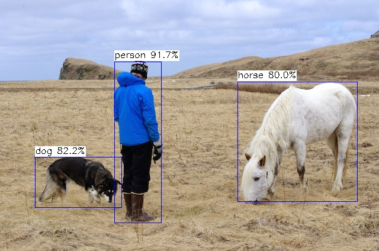

## model_zoo
v5lite-s.tmfile: [https://drive.google.com/file/d/12HU-lpPxtic5LgbySN7UOY4NqUw0O5SS/view?usp=sharing](https://drive.google.com/file/d/12HU-lpPxtic5LgbySN7UOY4NqUw0O5SS/view?usp=sharing)
## Detection effect

### 10FPS can be used with yolov5-lite on CPU

Excluding the first three warm-ups, the device temperature is stable above 45°, the forward reasoning framework is ncnn, and the two benchmark comparisons are recorded




```
# 第四次
xxx@PC:~/Tengine/YOLOv5_Lite_Tengine -m ../weights/yolov5s-lite.tmfile -i ../data/horse.jpg -r 1 -t 1
tengine-lite library version: 1.5-dev
Repeat 1 times, thread 1, avg time 111.65 ms, max_time 111.65 ms, min_time 111.65 ms
--------------------------------------
detection num: 3
 0:  92%, [ 193,  104,  273,  376], person
16:  82%, [  59,  265,  206,  351], dog
17:  80%, [ 401,  138,  604,  341], horse
```
